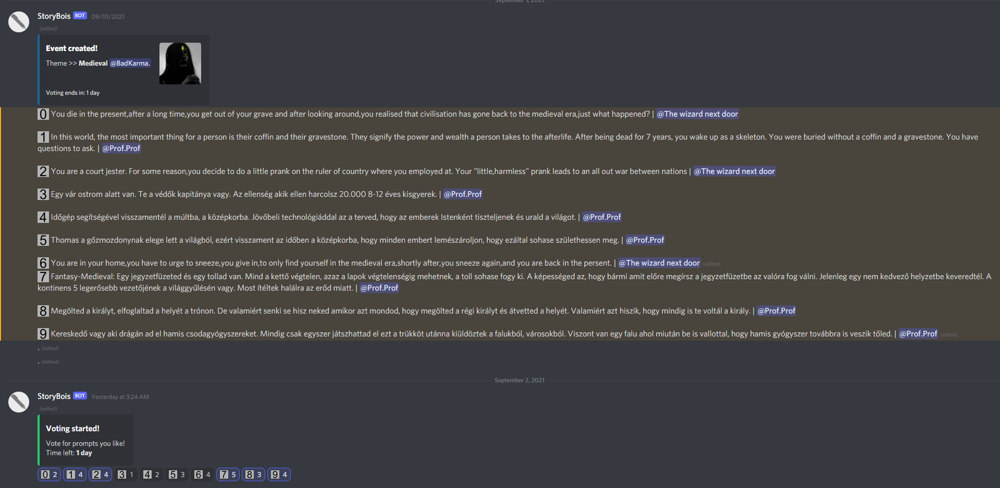
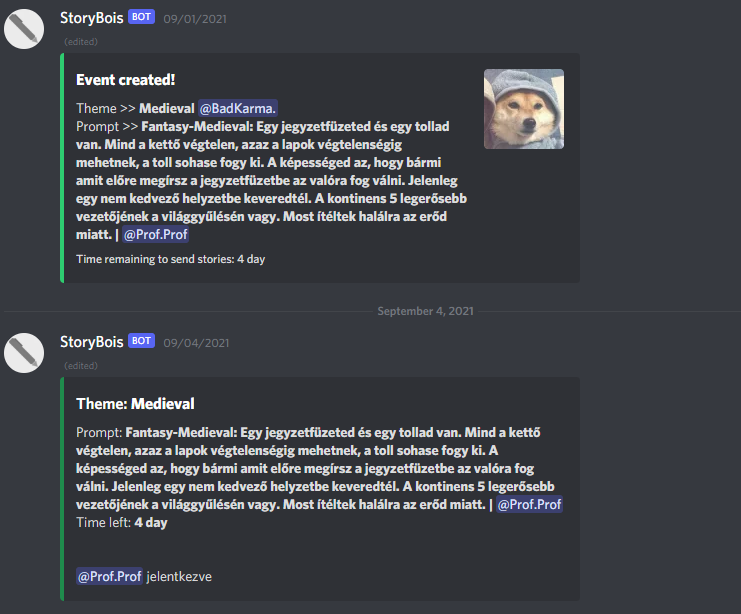

# Storybois-Discord-Bot
Automates the writing event on the StoryBois discord server

This discord bot takes prompts from chat.
After that when voting session begins, everyone votes with emojis (From 0-19).
The prompt that gets the most votes wins.
Then everyone sends stories to that prompt.

**Known bugs and problems:**\
Starting an event at 0:00 will instantly subtract a day from the prompt state. (Currently it instantly ends it) (The September-13 Bugfix maybe solves this problem.)
Currrent prompt message system only works with less than 8k characters.
Only 20 prompts are allowed (discord reaction limit), but the bot won't stop adding prompts to the list after 20. This can cause a bug.

**To add:**\
Better prompt message that supports unlimited characters. The current one works by sending 4 "." messages, then updating them with the prompt. Only allows less than 8k characters.
Better way to specify where the event messages are supposed to be sent.

